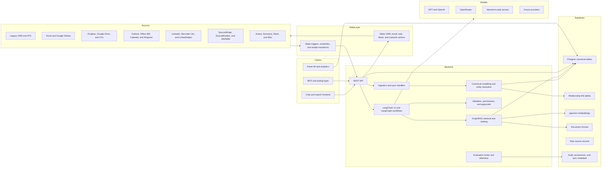
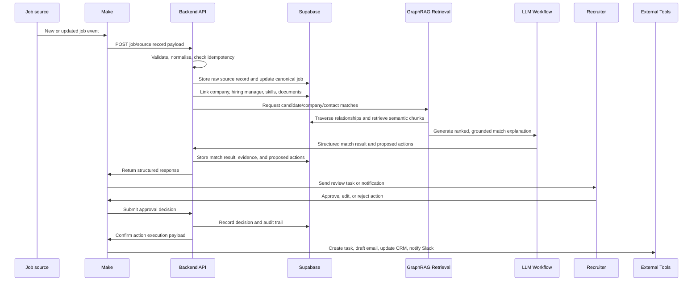
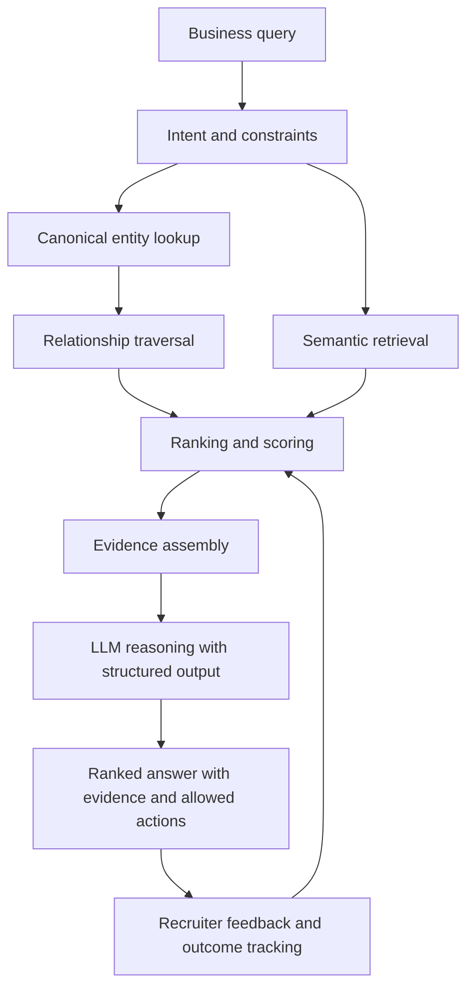

# North Star Architecture: GraphRAG Recruitment Intelligence System

<strong>1. Project Overview</strong>

This project is an **end-to-end GraphRAG-based intelligence system** for a recruitment and search business. It will consolidate fragmented operational, CRM, ATS, document, outreach, communication, and research data into a **central data platform**, model the **relationships between the main business entities**, and expose that intelligence through **backend APIs**, **workflow automation**, and eventually a **chat/query interface**.

This document is a **planning baseline only**. It does not define completed implementation work, application scaffolding, infrastructure provisioning, or package choices beyond the architectural direction needed for later delivery.

The system is intended to solve three related business problems:

- **Data is spread across too many tools**, including legacy CRMs, spreadsheets, document stores, LinkedIn-related tools, job boards, email/calendar systems, project tools, and outreach platforms.
- **Useful relationships are not currently modelled in one place**, especially relationships between companies, candidates, hiring managers, jobs, skills, documents, previous interactions, and source-system records.
- **Search and matching work is too manual**, with too much dependency on the operator knowing where to look, how to interpret fragmented data, and how to trigger follow-up actions.

The desired end-state is a **backend-owned intelligence layer** that can:

- Maintain a **central, auditable representation** of recruitment entities and their relationships.
- Use **GraphRAG retrieval, not just vector search**, to combine structured relationship traversal with semantic retrieval from unstructured documents.
- Support **candidate, company, hiring manager, job, and skill matching**.
- Provide **clean API endpoints** for Make.com, future frontend clients, MCP tools, and operational automations.
- Trigger **downstream actions** such as CRM updates, task creation, draft emails, outreach sequences, Slack notifications, and dashboard updates through **controlled workflows**.
- Evaluate **LLM and retrieval quality from the start**, so the system improves against measurable outcomes rather than anecdotal prompt testing.

<strong>2. Objectives and Non-Goals</strong>

<strong>Objectives</strong>

- Establish **Supabase** as the **central data and memory layer**.
- Model the recruitment domain as a **relational graph** using canonical tables, link tables, source records, embeddings, document chunks, sync metadata, and provenance.
- Use **Vercel-hosted backend services** as the owner of **business logic, intelligence, deduplication, entity resolution, retrieval, ranking, matching, and guardrails**.
- Use **LangChain v1 and LangGraph** inside the backend for model abstraction, tool abstraction, controlled workflows, and stateful reasoning flows.
- Use **Make.com** as the **external orchestration/action layer** for integrations with business tools.
- Expose **clean REST APIs** that can be called by Make.com, a future chat frontend, MCP tooling, and dashboard services.
- Include **CI/CD, automated testing, and LLM evaluation** from the first implementation phase.
- Build toward an operational system that can **recommend leads, surface patterns, and assist with recruitment workflows** while keeping **high-risk actions controlled**.

<strong>Non-Goals for Phase 1</strong>

Phase 1 should **not** attempt to build the entire agentic platform. It should not include:

- **Full migration** of every historical data source.
- **Full two-way sync** with every active system.
- **Autonomous outreach** without review.
- A **production-grade chat UI**.
- **Advanced analytics, forecasting, Monte Carlo simulations, or market optimisation.**
- **Deep custom ML training infrastructure.**
- A **full MCP ecosystem**.
- **Complete replacement of the CRM/ATS stack.**
- **Complex multi-agent autonomy.**
- A **dashboard layer** beyond minimal operational visibility.

Phase 1 should create the **smallest sensible foundation** that later phases can extend safely.

<strong>3. Recommended High-Level Architecture</strong>

The recommended architecture is **backend-first** and **data-model-first**.

- **Vercel backend:** Hosts API routes, ingestion endpoints, GraphRAG orchestration, LangChain/LangGraph workflows, evaluation entry points, and integration-facing REST endpoints.
- **Supabase:** Acts as the **central data platform** using Postgres, relational modelling, pgvector embeddings, storage where appropriate, row-level security, audit tables, and sync metadata.
- **Make.com:** Acts as the **workflow orchestration layer** for external systems. It should trigger ingestion events, call backend APIs, receive structured responses, and execute **approved actions** in tools such as CRM, email, Slack, task management, and outreach platforms.
- **LangChain v1:** Provides model, retriever, tool, structured output, and chain abstractions inside the backend.
- **LangGraph:** Provides durable/stateful workflow patterns for multi-step reasoning, retrieval, matching, approval, and action-planning flows.
- **Model abstraction layer:** Provides controlled access to GPT/OpenAI, OpenRouter, Nemotron-style providers, and any future model vendors without hard-coding business logic to one provider.
- **Evaluation layer:** Provides deterministic checks, retrieval tests, structured output validation, groundedness checks, ranking quality checks, and action-safety tests.
- **CI/CD layer:** Uses GitHub and GitHub Actions to run quality gates, evaluations, and deployment workflows into Vercel-managed environments.

<strong>Assumptions</strong>

- **Supabase will be the canonical operational data store** for the intelligence layer, even if tools such as JobAdder, SourceWhale, Asana, Outlook, Dropbox, Google Drive, and LinkedHelper remain in active use.
- The initial backend will be hosted on Vercel, with serverless or edge/serverless-compatible API routes selected based on workload requirements.
- Make.com is valuable for integration speed, but it should **not become the system of record or the reasoning layer**.
- **Historical data quality will be inconsistent**, especially across legacy CRM/ATS records, spreadsheets, CV files, LinkedIn-derived exports, and email/document stores.
- Some data sources may have legal, contractual, or technical restrictions around scraping, automated access, or reuse. Those constraints must be checked before implementation.
- **"GraphRAG" means combining graph-style relationship traversal and semantic retrieval**, not merely storing embeddings in a vector column.
- The provided spreadsheet/PDF should be treated as **directional rather than perfectly clean**. It contains useful signals about legacy systems, active systems, and priorities, but Phase 0 should verify statuses, ownership, and integration feasibility before implementation.

<strong>4. Major System Components</strong>

<strong>Data Ingestion Layer</strong>

Responsible for bringing data into the platform from **legacy exports, active system APIs, CSV files, document stores, email/calendar systems, and Make.com-triggered events**.

Key responsibilities:

- Accept **source-system records** via REST endpoints.
- Support **batch imports** for legacy data.
- Support **event-style updates** for active systems.
- Track **source, timestamp, import run, record hash, and sync status**.
- Validate required fields and **reject or quarantine malformed inputs**.
- Preserve **raw source records** before transformation where practical.

<strong>Canonical Domain and Data Model Layer</strong>

Responsible for converting fragmented source data into **stable canonical entities and relationships**.

Core entities likely include:

- **Companies**
- **Candidates**
- **Hiring managers and contacts**
- **Jobs and opportunities**
- **Skills**
- **Documents**
- **Interactions**
- **Source-system records**
- **Outreach events**
- **Tasks and workflow actions**

The core modelling principle should be: **preserve raw input**, **map to canonical entities**, and **connect entities through auditable relationship tables**.

<strong>GraphRAG and Retrieval Layer</strong>

Responsible for combining **structured graph traversal** with **semantic retrieval**.

Example retrieval patterns:

- Find **candidates with skills** related to a new job specification, then boost those with prior positive interactions or company relevance.
- Find **hiring managers connected to companies advertising for a skillset**, then inspect prior communication history and source-system activity.
- Find **companies similar to a successful placement history** based on sector, skills, hiring patterns, geography, and relationship history.
- Retrieve **CV chunks, interaction notes, job descriptions, and LinkedIn-derived snippets**, then ground LLM reasoning in those retrieved facts.

<strong>Reasoning and Agent Orchestration Layer</strong>

Responsible for **controlled LLM-assisted workflows**. This layer should live in the **backend**, not in Make.com.

Key responsibilities:

- **Query planning.**
- **Retrieval orchestration.**
- **Structured output generation.**
- **Ranking and explanation.**
- **Tool selection under guardrails.**
- **Human approval routing** for high-risk actions.
- **State tracking** for multi-step workflows.

<strong>API Layer</strong>

Responsible for exposing a **stable contract** to Make.com, future frontend clients, MCP tools, dashboards, and internal scripts.

Initial API surface should be **narrow** and intentionally designed around **business capabilities**:

- **Ingest or update source records.**
- **Search canonical entities.**
- **Request candidate/job/company matches.**
- **Retrieve entity context.**
- **Submit feedback on match quality.**
- **Create proposed actions.**
- **Confirm or reject proposed actions.**
- **Emit workflow results for Make.com.**

<strong>Workflow Automation Layer</strong>

Make.com should connect **external tools** to the backend. It should handle **integration glue, scheduling, simple transformations, retries, and execution of approved actions**.

It should not:

- Own **canonical state**.
- Implement **entity resolution**.
- Own **matching logic**.
- Own **LLM prompt logic**.
- Decide autonomously whether **risky actions** should be executed.

<strong>Future Frontend and Chat Layer</strong>

A frontend can be added later, likely hosted on Vercel. It should call the **same backend APIs as Make.com** rather than reimplementing retrieval or workflow logic.

Likely future frontend capabilities:

- **Chat/query interface.**
- **Entity search.**
- **Match review.**
- **Workflow approval queue.**
- **Data quality review.**
- **Candidate/company/job profile pages.**
- **Evaluation feedback collection.**

<strong>Analytics and Dashboard Layer</strong>

Analytics should be treated as a **later phase**. Power BI or a more suitable dashboard layer can consume **curated Supabase views or exports**.

Future analytics capabilities may include:

- **Recruitment funnel metrics.**
- **Outreach activity and conversion tracking.**
- **Market/skill trend analysis.**
- **Candidate source quality.**
- **Hiring manager engagement analysis.**
- **Forecasting and resource allocation analysis.**

<strong>5. Architecture Diagrams</strong>

<strong>High-Level Architecture</strong>

<strong>Example Operational Flow: New Job to Recommended Actions</strong>

<strong>GraphRAG Retrieval Pattern</strong>

<strong>6. Recommended Execution Order / Battle Plan</strong>

<strong>Phase 0: Discovery, Source Audit, and Design</strong>

**Goal:** Establish the **data, domain, integration, and risk baseline** before implementation starts.

**Key outputs:**

- **Source systems inventory.**
- **Legacy migration map.**
- **Active integrations map.**
- **Initial domain model.**
- **Source-of-truth rules.**
- **Data quality and deduplication assessment.**
- **Security, permissions, and compliance notes.**
- **Initial API capability map.**
- **Initial evaluation plan.**

**Dependencies:**

- Client access to exports, sample records, and system owners.
- Confirmation of which systems are legacy versus active.
- Confirmation of legal and platform constraints for LinkedIn-related data, scraping, and automated access.

**Why this comes first:** **GraphRAG quality depends on the entity model and relationship quality.** Building before the source audit risks creating a technically neat system around the wrong data assumptions.

<strong>Phase 1: Core Backend Foundation and Supabase Schema</strong>

**Goal:** Create the **smallest reliable implementation foundation** for canonical entities, ingestion, retrieval, evaluation, and deployment.

**Key outputs:**

- **Vercel backend project structure.**
- **Supabase schema** for core canonical entities and source records.
- **Initial link tables** for people, companies, jobs, skills, documents, and interactions.
- **Initial document chunk and embedding model.**
- **Basic REST API contract.**
- **Basic ingestion endpoints** for a small number of priority sources.
- **Initial GraphRAG retrieval endpoint.**
- **Initial evaluation harness.**
- **GitHub Actions CI pipeline.**
- **Vercel deployment pipeline.**

**Dependencies:**

- Phase 0 domain model and source-of-truth decisions.
- Supabase project and environment strategy.
- Model provider decision for first implementation.
- Agreement on initial priority sources.

**Why this comes here:** **The backend and schema are the foundation** for every later workflow, chat interface, and integration. Make.com workflows should call this layer rather than compensating for its absence.

<strong>Phase 2: Ingestion and Sync Endpoints</strong>

**Goal:** Bring a **controlled subset of source data** into the canonical model and make **sync behaviour repeatable**.

**Key outputs:**

- **Batch import path** for selected legacy data.
- **Event-style ingestion endpoints** for selected active systems.
- **Source record mapping rules.**
- **Idempotency keys and sync metadata.**
- **Quarantine process** for invalid records.
- **Initial deduplication and entity resolution rules.**
- **Import run audit trail.**

**Dependencies:**

- Phase 1 schema and API foundation.
- Sample data from priority systems.
- Source-system identifiers and export formats.

**Why this comes here:** **Retrieval and reasoning quality require stable data ingestion.** Two-way sync is risky until canonical identity and provenance are reliable.

<strong>Phase 3: GraphRAG Retrieval and Matching</strong>

**Goal:** Implement the first useful intelligence capability: **grounded matching across jobs, candidates, companies, hiring managers, skills, interactions, and documents**.

**Key outputs:**

- **Retrieval patterns** combining relationship traversal and semantic search.
- **Candidate-to-job matching.**
- **Company-to-skill or market matching.**
- **Hiring-manager discovery.**
- **Evidence-backed explanations.**
- **Ranking feedback capture.**
- **Retrieval and ranking evaluation datasets.**

**Dependencies:**

- Canonical entities populated from Phase 2.
- Embedding strategy and document chunking.
- Defined quality metrics and expected outputs.

**Why this comes here:** **Matching is the central business value.** It should be built after the data foundation but before broad workflow automation.

<strong>Phase 4: Make.com Integrations</strong>

**Goal:** Use **Make.com** to connect the backend to active business tools and execute **controlled operational workflows**.

**Key outputs:**

- **Make.com scenarios** for selected triggers.
- **Backend API calls** from Make.com.
- **Structured response handling.**
- **Approval workflows** for high-impact actions.
- **CRM/task/email/Slack update actions.**
- **Retry and failure handling conventions.**

**Dependencies:**

- Stable backend endpoints.
- Agreed action permissions.
- Priority workflow inventory.

**Why this comes here:** **Make.com is valuable once it has a reliable backend brain to call.** Introducing it too early risks encoding business rules in scenarios that should belong in the backend.

<strong>Phase 5: Chat and Query Interface</strong>

**Goal:** Add a **user-facing query layer** over the same backend intelligence APIs.

**Key outputs:**

- **Initial chat/search frontend.**
- **Entity context views.**
- **Match review experience.**
- **Approval queue.**
- **Feedback collection.**
- **Basic user permissions.**

**Dependencies:**

- Stable retrieval and matching endpoints.
- Guardrails and structured output validation.
- User roles and access rules.

**Why this comes here:** **A chat UI is most useful once retrieval, evidence, and action proposals are already reliable.**

<strong>Phase 6: Analytics, Forecasting, and Optimisation</strong>

**Goal:** Add **analytical and forecasting capabilities** after operational data is flowing through the system.

**Key outputs:**

- **Curated analytics views.**
- **KPI dashboards.**
- **Funnel and conversion tracking.**
- **Market/skill trend analysis.**
- **Source quality analysis.**
- **Forecasting experiments.**
- **Resource allocation recommendations.**

**Dependencies:**

- Stable canonical data and event history.
- Clear KPI definitions.
- Sufficient volume and quality of outcome data.

**Why this comes here:** **Analytics and forecasting need clean historical data.** Building dashboards before data quality and event capture are stable risks producing misleading outputs.

<strong>7. Recommended Phase 1 Scope</strong>

Phase 1 should be **deliberately narrow**. The purpose is to establish the **platform foundation** and prove **one or two core business workflows**, not to replace every tool.

Recommended Phase 1 scope:

- **Core Supabase schema** for companies, people, candidates, contacts, jobs, skills, documents, interactions, source records, and relationship tables.
- **Raw source record storage and provenance tracking.**
- **Initial document chunking and embedding design** for CVs, job specs, notes, and relevant source text.
- **Initial canonical identity rules** for people, companies, jobs, and skills.
- **A small set of REST endpoints:**
  - Ingest source record.
  - Upsert company/person/job.
  - Attach document or document metadata.
  - Search entity context.
  - Request candidate/job match.
  - Submit match feedback.
  - Create proposed workflow action.
- **Initial GraphRAG retrieval capability** that combines:
  - Skill matching.
  - Candidate/job relationships.
  - Company/contact relationships.
  - Document chunk retrieval.
  - Interaction history where available.
- **Initial Make.com integration points:**
  - Trigger ingestion from a selected source or export.
  - Send match results to Slack, task system, or email draft workflow.
  - Capture approval/feedback and send it back to the backend.
- **Initial evaluation harness:**
  - Deterministic schema checks.
  - Structured output validation.
  - Retrieval fixture tests.
  - A small labelled matching dataset.
  - Action-safety checks.
- **GitHub Actions CI checks and Vercel deployment workflow.**

Recommended Phase 1 exclusions:

- Full production chat UI.
- Broad two-way sync across all systems.
- Fully autonomous outreach.
- Deep analytics/dashboarding.
- Advanced ML training.
- Complete historical migration.
- Multi-agent workflow complexity beyond the minimum needed for retrieval and action proposal.

<strong>8. Data Modelling Recommendations</strong>

The data model should use **Supabase/Postgres as a graph-like relational system** rather than introducing a separate graph database prematurely.

<strong>Core Pattern</strong>

Use:

- **Canonical entity tables** for stable business objects.
- **Link tables** for relationships between entities.
- **Source-system record tables** for raw and mapped external records.
- **Document tables** for files, metadata, and extracted text.
- **Chunk tables** for retrievable text units.
- **Embedding columns** for semantic search.
- **Audit tables** for state changes, sync runs, match decisions, and action execution.
- **Feedback tables** for recruiter judgements and downstream outcomes.

<strong>Example Relationship Types</strong>

- Candidate has skill.
- Candidate worked at company.
- Candidate is also contact or hiring manager.
- Hiring manager works at company.
- Job requires skill.
- Job belongs to company.
- Interaction involves person, company, job, or document.
- Document describes candidate, job, company, or interaction.
- Source record maps to canonical entity.
- Outreach action targets person or company.

<strong>Source-of-Truth Strategy</strong>

Each canonical field should have a **source-of-truth rule**. For example:

- **Email addresses** may be sourced from CRM/ATS, Outlook, LinkedIn exports, or manual update, but **confidence and recency** should decide which value is primary.
- **Candidate CV text** should preserve the original document and extracted text, not just the LLM summary.
- **Skills** should be normalised into a canonical vocabulary, while preserving source phrases.
- **Job status** should have an explicit authoritative source per workflow.
- **System-generated recommendations** should not overwrite human-confirmed canonical data without review.

<strong>Deduplication and Entity Resolution</strong>

**Entity resolution is a major workstream, not a minor cleanup task.**

Recommended signals:

- Email address.
- Phone number.
- LinkedIn profile URL or public identifier where legally usable.
- Company domain.
- Person name plus company plus role.
- CV document fingerprints.
- Source-system IDs.
- Interaction history.
- Skill and employment overlap.

The model should support **confidence scores, merge decisions, split decisions, and manual override history**.

<strong>Auditability and Provenance</strong>

Every **derived recommendation** should be traceable to:

- **Source records.**
- **Canonical entities.**
- **Retrieved documents or chunks.**
- **Relationship traversal path.**
- **Model provider and model version.**
- **Prompt or workflow version.**
- **Ranking/scoring version.**
- **User feedback or approval status.**

Without **provenance**, the system will be difficult to debug, evaluate, and trust.

<strong>9. Make.com Integration Guidance</strong>

Make.com should be used as the **external workflow orchestration and action execution layer**.

Recommended uses:

- Listen for **changes in active systems** where native APIs or triggers are available.
- **Poll or schedule ingestion jobs** for sources that lack good webhooks.
- Send **source-system payloads** to backend ingestion endpoints.
- Receive **structured match results, action proposals, and status responses** from the backend.
- Execute **approved actions** in external tools:
  - Create or update CRM/ATS records.
  - Create Asana tasks.
  - Send Slack notifications.
  - Draft emails.
  - Start outreach sequences.
  - Update spreadsheets where still required.
  - Trigger dashboard refreshes.
- Route **approval decisions** back to the backend.
- Handle **simple retries and operational notifications**.

Make.com should not:

- Own **canonical identity**.
- Store the **master record** of candidates, companies, jobs, skills, or interactions.
- Implement **matching or ranking logic**.
- Own **prompt templates or LLM reasoning**.
- Make **final decisions on high-impact actions** without backend guardrails and human approval.
- Become the place where **business-critical logic** is hidden across many scenarios.

Practical Make.com design rules:

- Treat **backend APIs as the contract**.
- Keep payloads **structured and versioned**.
- Use **idempotency keys** for event ingestion.
- Log **scenario run IDs** back into Supabase.
- Prefer **human approval** for outreach, CRM mutation, and contact enrichment during early phases.
- Keep **transformations simple**; complex mapping belongs in the backend.
- Use Make.com to **reduce integration time**, not to replace software architecture.

<strong>10. LangChain v1 and LangGraph Guidance</strong>

**LangChain v1** should be used for **model and tool abstraction** inside the backend. It should help standardise calls to model providers, retrievers, structured output parsers, and tool interfaces.

**LangGraph** should be used for **stateful or multi-step workflows** where the system needs durable control over:

- **Retrieval planning.**
- **Entity context assembly.**
- **Candidate/job matching.**
- **Tool selection.**
- **Human approval checkpoints.**
- **Retry and fallback paths.**
- **Action proposal generation.**
- **Long-running workflow state.**

Recommended conceptual pattern:

- The backend receives a **business request**.
- The backend resolves relevant **canonical entities and permissions**.
- LangGraph coordinates **retrieval, scoring, LLM reasoning, and action planning**.
- LangChain abstractions call the selected **model provider and tools**.
- The backend validates **structured outputs**.
- The backend stores **evidence, decisions, and proposed actions**.
- Make.com executes only the **approved external actions**.

**Tool calling should be controlled.** Tools should have explicit permissions, typed inputs, typed outputs, audit logging, and approval requirements for high-impact actions.

Avoid early overuse of **agent autonomy**. The first useful version should behave more like a **grounded workflow engine with LLM reasoning** than an unconstrained agent.

<strong>11. LLM Evaluation Strategy</strong>

**Evaluation must be included from the beginning.** The system will be judged on whether it retrieves the right evidence, ranks useful matches, explains recommendations accurately, and avoids unsafe actions.

<strong>Deterministic Checks</strong>

- **API response schema validation.**
- **Required field validation.**
- **Entity ID and relationship integrity checks.**
- **Idempotency checks** for repeated ingestion events.
- **Permission checks** for action proposals.
- **Regression tests** for known mapping rules.

<strong>Structured Output Validation</strong>

- Validate **LLM responses against strict schemas**.
- Reject responses that omit **required evidence**.
- Reject **malformed action proposals**.
- Enforce **allowed action types**.
- Validate **confidence, rationale, and evidence references**.

<strong>Groundedness and Hallucination Checks</strong>

- Require every recommendation to reference **retrieved evidence**.
- Detect **claims not supported** by retrieved chunks or structured records.
- Compare generated summaries against **source excerpts**.
- Flag recommendations with **weak or missing evidence** for human review.

<strong>Retrieval Quality Checks</strong>

- Maintain a **small fixture set** of known jobs, candidates, companies, and skills.
- Measure whether **expected entities appear in top-k results**.
- Track **precision and recall** for known retrieval cases.
- Test **graph traversal** separately from semantic retrieval.
- Test **combined retrieval** against realistic recruitment prompts.

<strong>Ranking and Matching Quality Checks</strong>

- Build a **labelled dataset** from recruiter feedback and historical outcomes.
- Track **top-k match quality**.
- Track **explanation usefulness**.
- Track **false positives and false negatives**.
- Capture whether accepted recommendations later produced **meaningful outcomes**.

<strong>Action-Safety and Permission Checks</strong>

- Ensure **risky actions require approval**.
- Ensure **draft content is labelled as draft**.
- Ensure **external writes are disabled** in evaluation and test environments.
- Ensure tools cannot mutate records without **explicit allowed action types**.
- Ensure Make.com scenarios cannot **bypass backend approval requirements**.

<strong>CI-Based Evaluation</strong>

**GitHub Actions** should run a practical evaluation suite on **pull requests and before deployment**:

- **Unit and integration tests.**
- **Schema and contract checks.**
- **Retrieval fixture tests.**
- **Structured LLM output checks** using fixed test cases.
- **Prompt/workflow regression tests.**
- **Safety and permission tests.**

**LLM evaluations should start small** and become more formal as real feedback and outcomes accumulate.

<strong>12. CI/CD Recommendations</strong>

The project should use **GitHub as the source of truth** for implementation artifacts.

Recommended CI/CD setup:

- **GitHub repository with branch protection.**
- **Pull request workflow** for all production changes.
- **GitHub Actions** for linting, tests, type checks, evaluation checks, and documentation checks.
- **Vercel deployment** for backend preview and production environments.
- **Supabase migrations tracked in source control.**
- **Separate development, preview/staging, and production environments** where practical.
- **Environment variables managed through Vercel and Supabase secret management**, not committed to the repository.
- **CI checks** for missing environment variable documentation.
- **CI checks** for API contract changes where possible.
- **Deployment gates** for failing evaluations.

Recommended pipeline shape:

```mermaid
graph LR
    Dev[Developer branch]
    PR[Pull request]
    CI[GitHub Actions]
    Preview[Vercel preview deployment]
    Review[Engineering review]
    Main[Main branch]
    ProdCI[Production checks]
    Prod[Vercel production deployment]
    Monitor[Logs, eval telemetry, and feedback]

    Dev --> PR
    PR --> CI
    CI --> Preview
    Preview --> Review
    Review --> Main
    Main --> ProdCI
    ProdCI --> Prod
    Prod --> Monitor
```

**Deployment should not be treated as complete** unless evaluation and operational telemetry are also considered.

<strong>13. Risks, Pitfalls, and Common Failure Modes</strong>

- **Making Make.com the brain:** Make.com is useful for integration and action execution, but it will become hard to test, version, and reason about if it owns intelligence or canonical business logic.
- **Underestimating entity resolution:** Duplicate candidates, contacts, companies, and jobs will undermine matching quality unless identity rules and merge workflows are treated as core architecture.
- **No source-of-truth rules:** If the system cannot decide which source wins for a field, two-way sync will create conflicts and data decay.
- **Weak provenance:** Recommendations without traceable evidence will be hard to trust, evaluate, or debug.
- **Overbuilding agent autonomy too early:** Autonomous agents should not be allowed to execute outreach, CRM mutation, or data enrichment until retrieval, evaluation, and approval controls are mature.
- **Mistaking vector search for GraphRAG:** pgvector search over chunks is useful, but GraphRAG requires structured relationship traversal and entity-aware retrieval.
- **Trying to integrate everything at once:** The tool list is large. A phased approach is required to avoid a brittle integration mesh.
- **Poor evaluation discipline:** Without test fixtures and outcome tracking, prompt changes and model changes will create silent regressions.
- **Unclear legal constraints:** LinkedIn-derived data, scraping workflows, and automated profile refreshes may carry platform, contractual, or compliance risks.
- **Over-trusting raw legacy data:** Legacy CRMs, spreadsheets, and document stores may contain stale, duplicated, or contradictory records.
- **Letting summaries replace source documents:** LLM summaries are useful but should not replace original documents, extracted text, or evidence references.
- **Ignoring operational failure modes:** Sync retries, partial failures, duplicate events, and rate limits must be designed into the integration layer.
- **Premature analytics:** Forecasting and dashboards will be misleading if the underlying event, outcome, and source data are not clean.

<strong>14. Open Questions and Decisions to Resolve</strong>

Before implementation begins, the team should resolve:

- Which systems are definitely **legacy** and should be migrated or retired?
- Which **active systems** must remain operational in the first six months?
- Which system, if any, remains the **operational CRM/ATS** during early phases?
- What is the **first priority workflow**: job-to-candidate matching, company lead generation, hiring-manager discovery, CV ingestion, or outreach support?
- Which data sources are available via **API, export, webhook, or manual upload**?
- What **legal and platform constraints** apply to LinkedIn, LinkedHelper, scraped data, and third-party datasets?
- What fields are considered **sensitive or restricted**?
- What **user roles and approval permissions** are required?
- Which **model provider** should be used first for cost, quality, privacy, and reliability?
- What is the expected **latency** for matching and retrieval workflows?
- What **volume of CVs, emails, interactions, and source records** should the system expect initially?
- What is the **canonical skills taxonomy strategy**?
- What is the **merge/split process** for duplicate people and companies?
- What **actions are allowed automatically, which require approval, and which are out of scope**?
- What are the first **evaluation fixtures and success metrics**?
- What systems should **Make.com write back to** in the first production workflow?
- What data needs to be available for future **Power BI or dashboard reporting**?

<strong>15. Recommended Next Documents</strong>

After this North Star document, the next planning artifacts should be:

- **Domain model document:** Canonical entities, fields, relationship types, identity rules, and source-of-truth policy.
- **Source systems inventory and migration map:** Legacy systems, active systems, access method, export format, API availability, ownership, and priority.
- **API contract draft:** REST endpoints, payloads, response schemas, idempotency strategy, error conventions, and versioning.
- **Make.com workflow inventory:** Candidate scenarios, trigger systems, action systems, approval points, retries, and logging requirements.
- **Evaluation plan:** Test fixtures, labelled examples, retrieval metrics, ranking metrics, structured output checks, and CI evaluation gates.
- **Implementation roadmap:** Sequenced delivery plan with milestones, dependencies, owners, and release criteria.
- **Security and permissions document:** Data sensitivity, user roles, row-level security approach, audit logging, approval model, and external action permissions.
- **Entity resolution strategy:** Deduplication signals, confidence scoring, merge/split process, human review flow, and conflict resolution.
- **Data provenance and audit specification:** How source records, generated outputs, model calls, approvals, and external actions are traced.
- **Analytics roadmap:** KPI definitions, reporting views, dashboard requirements, forecasting candidates, and data readiness criteria.

<strong>16. Baseline Design Position</strong>

The baseline design position is:

- **Supabase is the central data and memory layer.**
- **Vercel backend services own intelligence, data modelling, retrieval, matching, evaluation, and guardrails.**
- **Make.com connects the backend to the operational stack and executes approved actions.**
- **LangChain v1 and LangGraph power controlled backend reasoning workflows.**
- **GraphRAG combines relational graph traversal, semantic retrieval, evidence assembly, and structured LLM reasoning.**
- **Evaluation and CI/CD are first-class project concerns, not later polish.**
- **Phase 1 should prove a narrow, useful workflow with strong foundations** before broader automation, chat, analytics, or autonomy.

